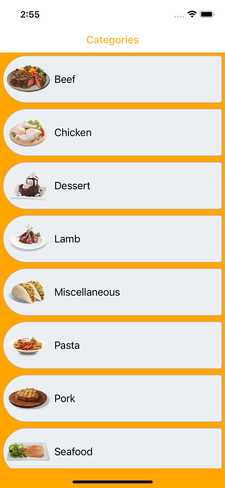
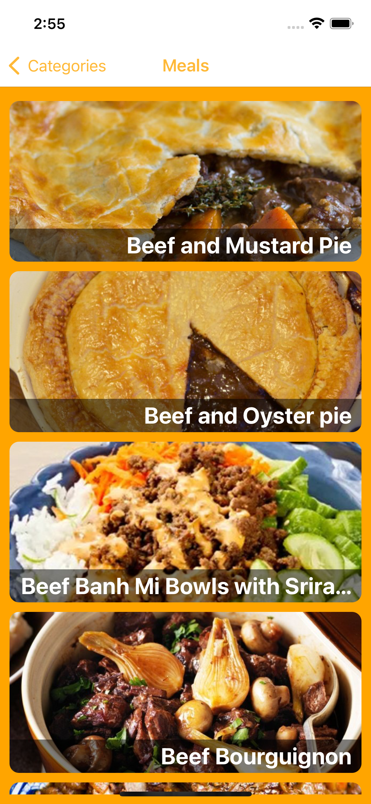
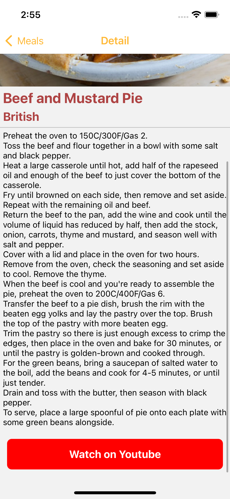

##  React-Native-Meal-App

Meal recipes app that fetches data from the api, users can select categories, meals and details.

<div>
    
    
    
</div>

### API
```
https://www.themealdb.com/api.php
```